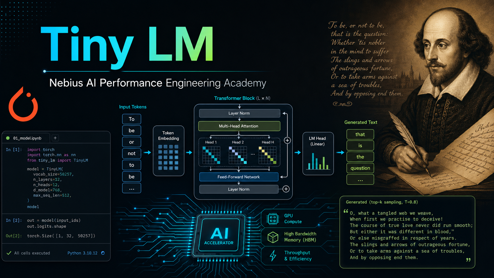
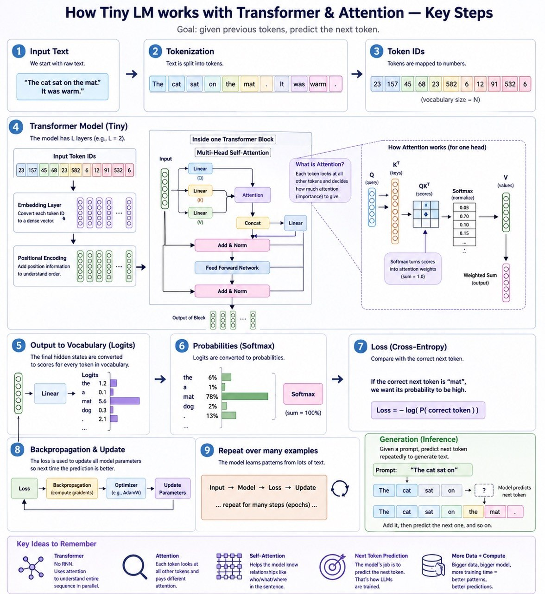

# Homework 6: Tiny Transformer Language Model



This folder contains notebook-based practice for building and running small language-modeling demos:

- `src/tiny_transformer_lm.ipynb` is the homework notebook: implement a decoder-only Transformer language model from scratch.
- `src/MNIST_Parallel_Hyperparameter_Tuning_Demo.ipynb` contains a separate parallel tuning demo.
- `src/efficient_fine_tuning.ipynb` demonstrates prompt tuning and LoRA on tweet irony classification.
- `src/huggingface_boilerplate.py` supports the efficient fine-tuning demo.

## Homework Objective

Implement a GPT-style decoder-only Transformer in `src/tiny_transformer_lm.ipynb` and train it on character-level Tiny Shakespeare.

The model should learn next-character prediction and generate text that roughly resembles Shakespearean dialogue.



You will implement:

1. multi-head causal self-attention;
2. a position-wise feed-forward network;
3. a Transformer block with residual connections and LayerNorm;
4. the full language model;
5. autoregressive generation.

## Environment

This project is configured for Python `3.14.4`, the latest stable CPython release available on Python.org as of April 27, 2026.

Create and sync the local environment with `uv`:

```bash
uv sync
```

Then start Jupyter:

```bash
uv run jupyter lab
```

The homework notebook can run locally on Apple Silicon with PyTorch MPS after a small device-selection edit, or in Nebius Cloud on CUDA. See `docs/RUNNING_DEMOS_AND_HOMEWORK.md`.

Optional project defaults are stored in `.env`. The current notebook has hardcoded values, so treat `.env` as documentation/configuration unless you update the notebook to read from `os.getenv`.

If you run the demo notebooks, prefer the `uv` environment over notebook-local `pip install` pins. The project dependency set uses current package versions compatible with Python `3.14.4`.

## Homework Run Order

1. Open `src/tiny_transformer_lm.ipynb`.
2. Run setup and data cells.
3. Review each completed `# DONE` implementation block.
4. Run each sanity-check cell after its corresponding implementation.
5. Generate the small untrained baseline sample.
6. Train the model and review the timing summary.
7. Calculate perplexity and bits per character.
8. Generate final sample text.
9. Save the notebook with all cells executed.

## Expected Outputs

After successful homework execution, the notebook should show passing sanity checks, an untrained baseline sample, training logs, a timing summary, final loss values, perplexity metrics, and trained generated text samples.

## Demo Flows

Mermaid diagrams for the two main demo flows are available in:

```text
docs/DEMO_FLOWS.md
```

Execution guidance for local Apple Silicon and Nebius Cloud is available in:

```text
docs/RUNNING_DEMOS_AND_HOMEWORK.md
```

The MNIST parallel HPO demo has its own guide:

```text
docs/MNIST_PARALLEL_HPO_DEMO.md
```

## Homework Deliverables

See `docs/HOMEWORK_ASSIGNMENT.md` for the task statement, expected outputs, and evaluation checklist.
