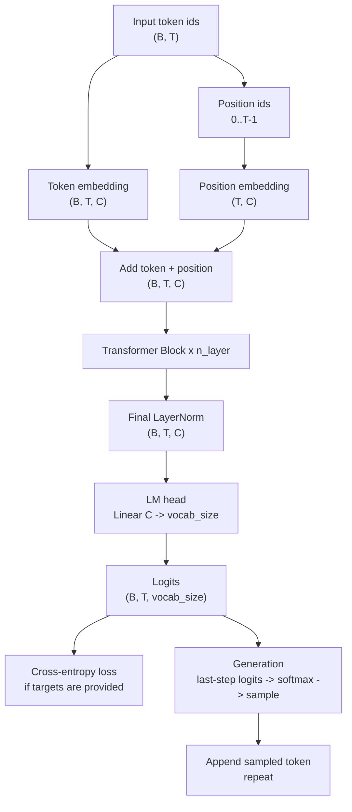

# Tiny Transformer Language Model

This note explains what the `src/tiny_transformer_lm.ipynb` model computes and how data moves through the network.

## Architecture



Each input example is a sequence of token ids with shape `(B, T)`, where `B` is batch size and `T` is context length. The model converts those ids into vectors of width `C = n_embd`, adds position information, runs the result through Transformer blocks, then predicts the next token distribution at every position.

## Core Calculations

### Embeddings

The token embedding table maps every character id to a learned vector:

```python
tok = self.token_emb(idx)  # (B, T, C)
```

The positional embedding table maps positions `0..T-1` to learned vectors:

```python
pos = self.pos_emb(torch.arange(T, device=idx.device))  # (T, C)
x = tok + pos  # (B, T, C)
```

The addition works because PyTorch broadcasts the `(T, C)` positional tensor across the batch dimension.

### Causal Self-Attention

Inside each block, attention projects `x` into queries, keys, and values:

```python
q, k, v = self.qkv(x).chunk(3, dim=-1)
```

These tensors are reshaped into multiple heads. For each head, attention scores are:

```python
scores = (q @ k.transpose(-2, -1)) / sqrt(head_size)
```

The lower-triangular mask sets future positions to `-inf` before softmax:

```python
scores = scores.masked_fill(mask == 0, float("-inf"))
att = softmax(scores, dim=-1)
```

This is what makes the language model autoregressive: token `t` may attend only to tokens `<= t`, never future tokens.

### Feed-Forward Network

After attention, the block applies the same two-layer MLP independently to each position:

```python
Linear(C, 4C) -> GELU -> Linear(4C, C) -> Dropout
```

The expansion to `4C` gives the block more capacity, while the projection back to `C` keeps the residual stream shape unchanged.

### Transformer Block

The notebook uses a pre-norm block:

```python
x = x + attention(LayerNorm(x))
x = x + feedforward(LayerNorm(x))
```

LayerNorm before each sublayer stabilizes training. Residual additions preserve the current representation and let gradients flow through deep stacks.

### Loss

The language modeling head produces logits of shape `(B, T, vocab_size)`. When targets are available, logits and targets are flattened:

```python
logits_flat = logits.view(B * T, vocab_size)
targets_flat = targets.view(B * T)
loss = F.cross_entropy(logits_flat, targets_flat)
```

This trains the model to predict the next character at every position in the batch.

### Generation

Generation repeats one-token sampling:

1. Keep only the last `block_size` tokens.
2. Run the model.
3. Take logits from the last time step.
4. Convert logits to probabilities with softmax.
5. Sample a token with `torch.multinomial`.
6. Append that token to the context.

Cropping to `block_size` is required because the positional embedding table has only `block_size` rows.
