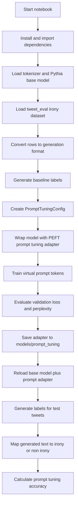
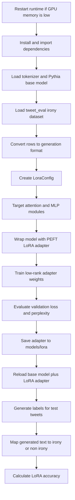
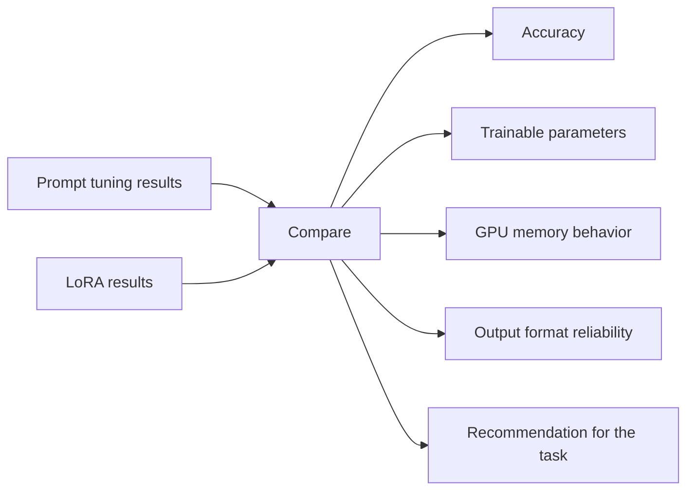

# Demo Flows

This document describes the two main demo paths in `efficient_fine_tuning.ipynb`.

## Demo 1: Prompt Tuning

Prompt tuning freezes the base model and trains a small set of virtual prompt embeddings.

## Demo 2: LoRA

LoRA freezes the base model and trains low-rank adapter matrices attached to selected transformer modules.

## Comparison Flow

